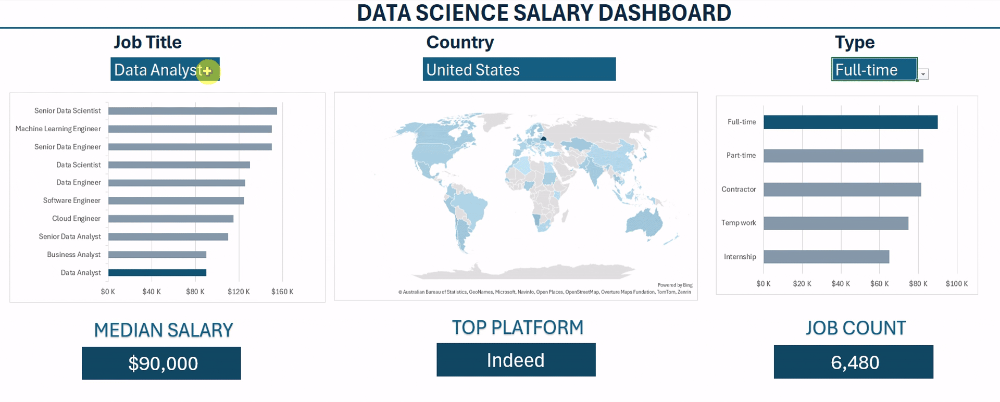
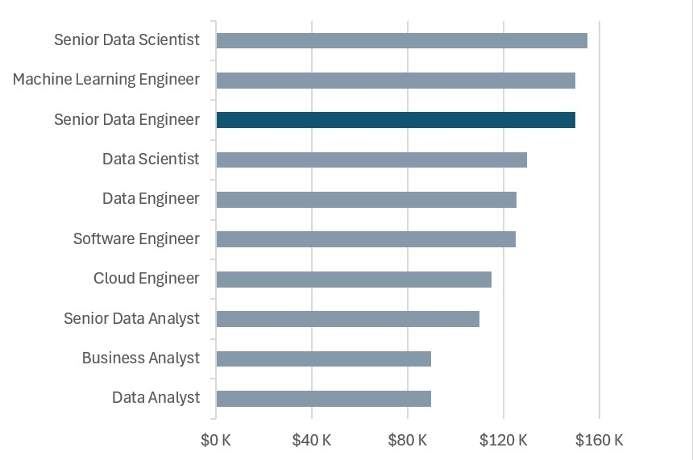
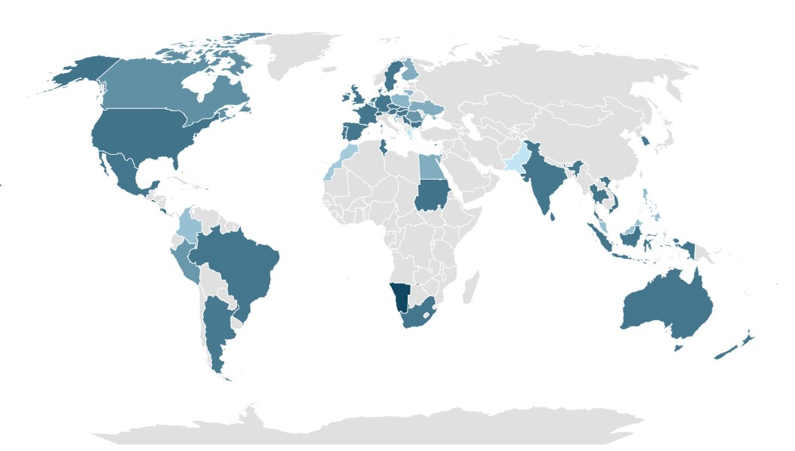
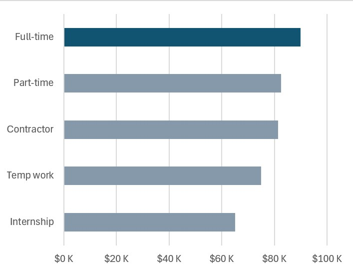
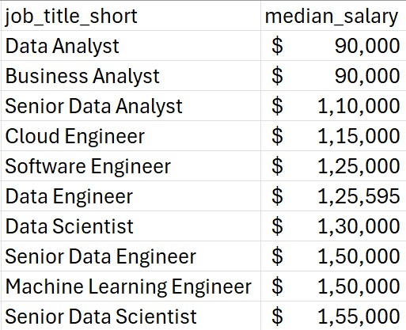

# Excel Salary Dashboard



## Introduction

This dashboard provides a detailed analysis of Data Science job salaries across different roles, countries, and employment types.
It was created to help users understand salary trends in the Data Science field and compare compensation across various job titles and regions.

The dataset used in this project includes information such as job titles, salary figures, work locations, job schedule types, and employment categories.
Using Excel formulas, charts, pivot tables, and interactive filters, the dashboard presents these insights in a clear and accessible format.

## Dashboard

Here is my final dashboard : [Dashboard_01.xlsx](Dashboard_01.xlsx)

## Excel Skills Used

The following Excel skills were utilized for analysis:
- 📉 Charts
- 🧮 Formulas and Functions
- ❎ Data Validation

## Dataset

The dataset used for this project contains real-world data science job information from 2023. It includes detailed information on:
- 👨‍💼 Job titles
- 💰 Salaries
- 📍 Locations
- 🛠️ Skills

## Dashboard Build

### 📉 Charts

#### 📊 Median Salary across Data Science jobs - Bar Chart



- 🛠️ Excel Features: Utilized bar chart feature (with formatted salary values) and optimized layout for clarity.
- 🎨 Design Choice: Horizontal bar chart for visual comparison of median salaries.
- 📉 Data Organization: Sorted job titles by descending salary for improved readability.
- 👁️ Visual Enhancement: Label formatting and consistent color coding make the comparison easy to understand at a glance.
- 💡 Insights Gained: This enables quick identification of salary trends, noting that Senior roles and Engineers are higher-paying than Analyst roles.

#### 🗺️ Median Salary across the world - Map Chart



- 🛠️ Excel Features: Utilized Excel's map chart feature to plot median salaries globally.
- 🎨 Design Choice: Color-coded map to visually differentiate salary levels across regions.
- 📊 Data Representation: Plotted median salary for each country with available data.
- 👁️ Visual Enhancement: Improved readability and immediate understanding of geographic salary trends.
- 💡 Insights Gained: Enables quick grasp of global salary disparities and highlights high/low salary regions.

#### 🗺️ Median Salary scross different Job Types - Bar Chart



- 🛠️ Excel Features: Utilized Excel’s bar chart and dynamic formulas to compare median salaries across different job types.
- 🎨 Design Choice: Visual separation of job types (Full-time, Contract, Internship, Part-time) to highlight salary variations clearly.
- 📊 Data Representation: Displayed median salary for each job type using structured tables and filtered lists.
- 👁️ Visual Enhancement: Label formatting and consistent color coding make the comparison easy to understand at a glance.
- 💡 Insights Gained: Shows how different job types vary in compensation, helping users identify which employment categories offer higher or lower salary ranges.

### 🧮 Formulas and Functions

#### 💰 Median Salary by Job Titles

```code
=MEDIAN(
IF(
    (jobs[job_title_short]=A2)*
    (jobs[job_country]=country)*
    (ISNUMBER(SEARCH(type,jobs[job_schedule_type])))*
    (jobs[salary_year_avg]<>0),
    jobs[salary_year_avg]
)
)
```
- 🔍 Multi-Criteria Filtering: Checks job title, country, schedule type, and excludes blank salaries.
- 📊 Array Formula: Utilizes MEDIAN() function with nested IF() statement to analyze an array.
- 🎯 Tailored Insights: Provides specific salary information for job titles, regions, and schedule types.
- 🔢 Formula Purpose: This formula populates the table below, returning the median salary based on job title, country, and type specified.

##### 🍽️ Background Table



#### ⏰ Count of Job Schedule Type

```code
=FILTER(L2#,(NOT(ISNUMBER(SEARCH("and",L2#))+ISNUMBER(SEARCH(",",L2#))))*(L2#<>0))
```

- 🔍 Unique List Generation: This Excel formula below employs the FILTER() function to exclude entries containing "and" or commas, and omit zero values.
- 🔢 Formula Purpose: This formula populates the table below, which gives us a list of unique job schedule types.

### ❎ Data Validation

#### 🔍 Filtered List

- 🔒 Enhanced Data Validation: Implementing the filtered list as a data validation rule under the Job Title, Country, and Type option in the Data tab ensures:
   - 🎯 User input is restricted to predefined, validated schedule types
   - 🚫 Incorrect or inconsistent entries are prevented
   - 👥 Overall usability of the dashboard is enhanced

## Conclusion

This dashboard provides a clear and structured analysis of salary trends across Data Science job roles, countries, and employment types. By combining Excel’s analytical functions with interactive visualizations, it enables users to quickly interpret compensation patterns and make informed decisions based on role, location, and job type. The project demonstrates practical Excel-based data analysis and serves as a useful reference for anyone exploring career insights or learning dashboard development.
